# Visited: https://en.wikipedia.org/wiki/Chess
**Time:** Tue May  5 08:19:29 UTC 2026

## Screenshot

## Raw HTML
[page.html](./page.html)

## Downloaded Media (95 files)
## Downloaded Media Files

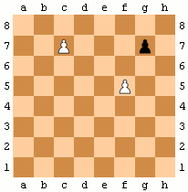
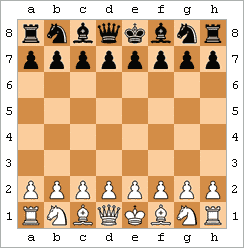
- [Chess.ogg](./media/Chess.ogg) (22698 KB)
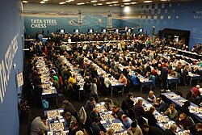

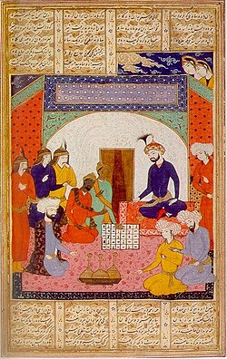

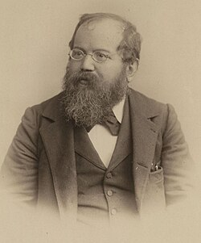
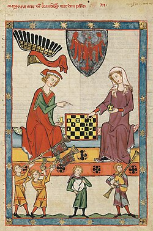
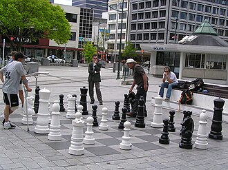
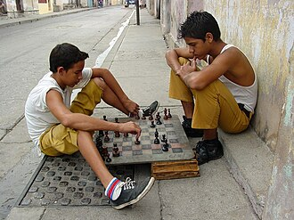

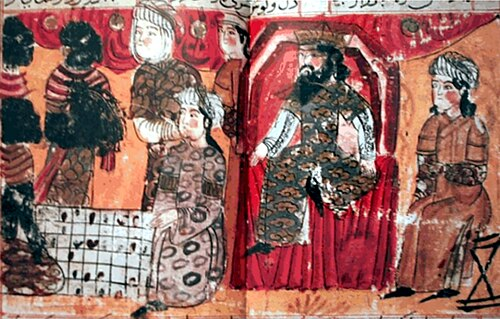

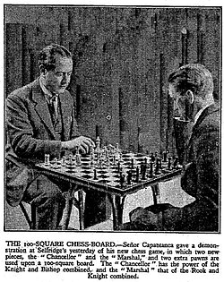

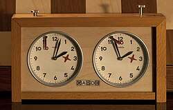

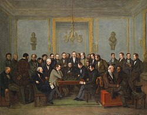

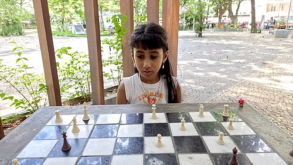

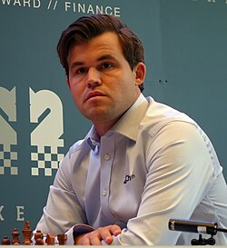
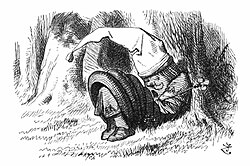
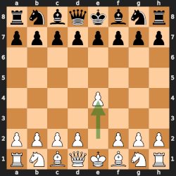

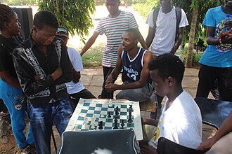

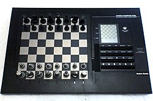
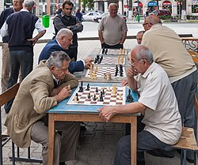
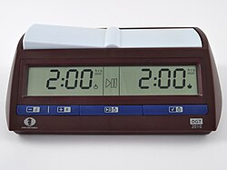
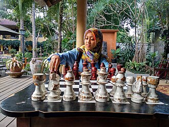
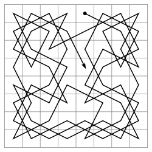

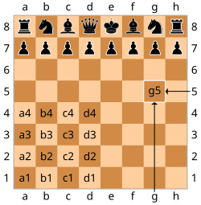
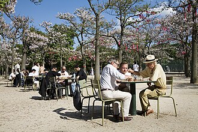
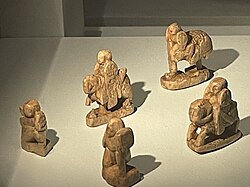

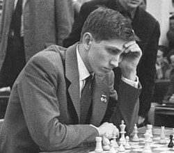

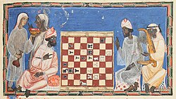
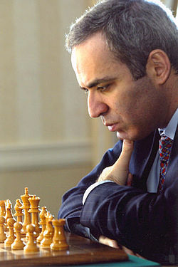
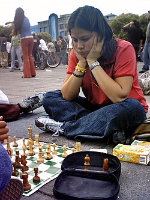

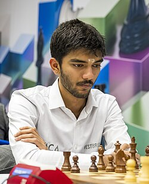

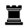

- [Chess.ogg.mp3](./media/Chess.ogg.mp3) (53725 KB)

- [Laws_of_Chess_2009.pdf](./media/Laws_of_Chess_2009.pdf) (293 KB)
- [2-0%20and%202-1.Programming_a_computer_for_playing_chess.shannon.062303002.pdf](./media/2-0%20and%202-1.Programming_a_computer_for_playing_chess.shannon.062303002.pdf) (175 KB)
- [Gobet_DevPsyc_Final.pdf](./media/Gobet_DevPsyc_Final.pdf) (196 KB)
- [Seasonality%20and%20chess.pdf](./media/Seasonality%20and%20chess.pdf) (6 KB)
- [Calvo%201998.pdf](./media/Calvo%201998.pdf) (162 KB)
- [Eder%202007-2.pdf](./media/Eder%202007-2.pdf) (2782 KB)
- [DeliberatePractice%28PsychologicalReview%29.pdf](./media/DeliberatePractice%28PsychologicalReview%29.pdf) (5 KB)
- [Zermelo.pdf](./media/Zermelo.pdf) (156 KB)
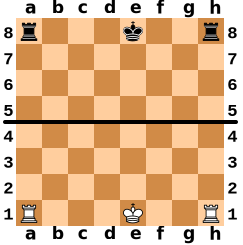
- [1777969157_DeliberatePractice%28PsychologicalReview%29.pdf](./media/1777969157_DeliberatePractice%28PsychologicalReview%29.pdf) (1284 KB)
- [1777969159_Zermelo.pdf](./media/1777969159_Zermelo.pdf) (156 KB)
- [1777969160_Gobet_DevPsyc_Final.pdf](./media/1777969160_Gobet_DevPsyc_Final.pdf) (196 KB)
- [1777969161_2-0%20and%202-1.Programming_a_computer_for_playing_chess.shannon.062303002.pdf](./media/1777969161_2-0%20and%202-1.Programming_a_computer_for_playing_chess.shannon.062303002.pdf) (175 KB)
- [1777969162_Seasonality%20and%20chess.pdf](./media/1777969162_Seasonality%20and%20chess.pdf) (65 KB)
- [1777969162_Calvo%201998.pdf](./media/1777969162_Calvo%201998.pdf) (162 KB)
- [1777969163_Laws_of_Chess_2009.pdf](./media/1777969163_Laws_of_Chess_2009.pdf) (293 KB)
- [1777969167_Eder%202007-2.pdf](./media/1777969167_Eder%202007-2.pdf) (2782 KB)

## Other Links
- [#](#)
- [#1200–1700:_Origins_of_the_modern_game](#1200–1700:_Origins_of_the_modern_game)
- [#1700–1873:_Romantic_era](#1700–1873:_Romantic_era)
- [#1873–1945:_Birth_of_a_sport](#1873–1945:_Birth_of_a_sport)
- [#1945–1990:_Post-World_War_II_era](#1945–1990:_Post-World_War_II_era)
- [#1990–present:_Rise_of_computers_and_online_chess](#1990–present:_Rise_of_computers_and_online_chess)
- [#Applied_mathematics](#Applied_mathematics)
- [#Arts_and_humanities](#Arts_and_humanities)
- [#Beginnings_of_chess_technology](#Beginnings_of_chess_technology)
- [#CITEREFAdams2006](#CITEREFAdams2006)
- [#CITEREFBinet1894](#CITEREFBinet1894)
- [#CITEREFBrunningYu-PingO&#39;ConnellWilliams2024](#CITEREFBrunningYu-PingO&#39;ConnellWilliams2024)
- [#CITEREFBurgess2000](#CITEREFBurgess2000)
- [#CITEREFBurgessNunnEmms2004](#CITEREFBurgessNunnEmms2004)
- [#CITEREFDavidson1949](#CITEREFDavidson1949)
- [#CITEREFEmms2004](#CITEREFEmms2004)
- [#CITEREFEvans1958](#CITEREFEvans1958)
- [#CITEREFFine2015](#CITEREFFine2015)
- [#CITEREFFranklin2003](#CITEREFFranklin2003)
- [#CITEREFGobetde_VoogtRetschitzki2004](#CITEREFGobetde_VoogtRetschitzki2004)
- [#CITEREFGrabnerSternNeubauer2007](#CITEREFGrabnerSternNeubauer2007)
- [#CITEREFHarding2003](#CITEREFHarding2003)
- [#CITEREFHartston1985](#CITEREFHartston1985)
- [#CITEREFHolding1985](#CITEREFHolding1985)
- [#CITEREFHooperWhyld1992](#CITEREFHooperWhyld1992)
- [#CITEREFHoward1961](#CITEREFHoward1961)
- [#CITEREFHsu2002](#CITEREFHsu2002)
- [#CITEREFKasparov2003a](#CITEREFKasparov2003a)
- [#CITEREFKasparov2003b](#CITEREFKasparov2003b)
- [#CITEREFKasparov2004a](#CITEREFKasparov2004a)
- [#CITEREFKasparov2004b](#CITEREFKasparov2004b)
- [#CITEREFKasparov2006](#CITEREFKasparov2006)
- [#CITEREFKeene1993](#CITEREFKeene1993)
- [#CITEREFLandsberger1992](#CITEREFLandsberger1992)
- [#CITEREFLasker1934](#CITEREFLasker1934)
- [#CITEREFLevitt2000](#CITEREFLevitt2000)
- [#CITEREFLi1998](#CITEREFLi1998)
- [#CITEREFMark2007](#CITEREFMark2007)
- [#CITEREFMetzner1998](#CITEREFMetzner1998)
- [#CITEREFMurray1985](#CITEREFMurray1985)
- [#CITEREFOlmert1996](#CITEREFOlmert1996)
- [#CITEREFParlett1999](#CITEREFParlett1999)
- [#CITEREFPritchard2000](#CITEREFPritchard2000)
- [#CITEREFRobbinsAndersonBarkerBradley1996](#CITEREFRobbinsAndersonBarkerBradley1996)
- [#CITEREFSaariluoma1995](#CITEREFSaariluoma1995)
- [#CITEREFShibut2004](#CITEREFShibut2004)
- [#CITEREFSilman1998](#CITEREFSilman1998)
- [#CITEREFTamburro2010](#CITEREFTamburro2010)
- [#CITEREFTarrasch1987](#CITEREFTarrasch1987)
- [#CITEREFTrautmann2015](#CITEREFTrautmann2015)

## Stats
- Links: 2558
- Media: 95
